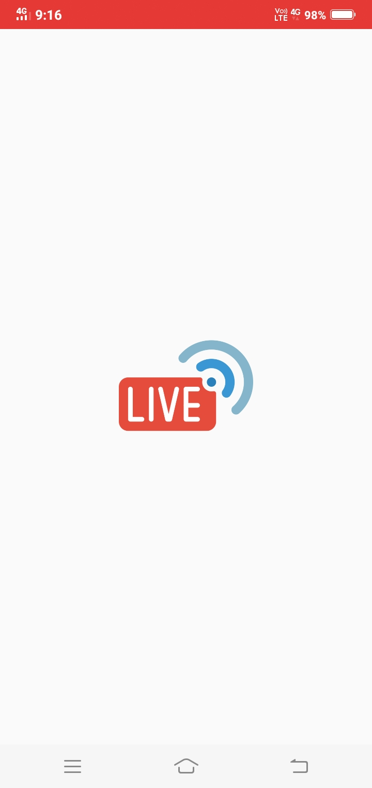
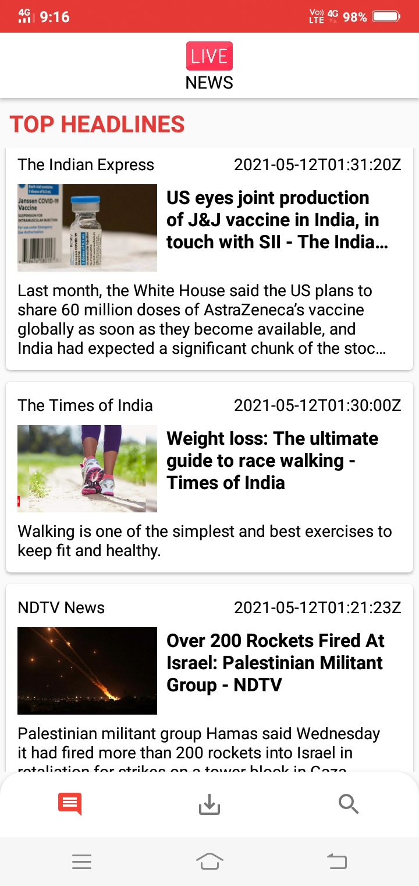
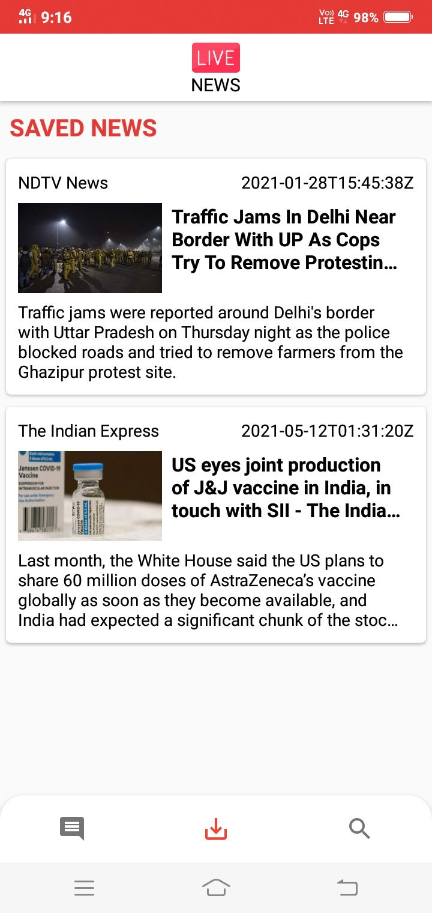
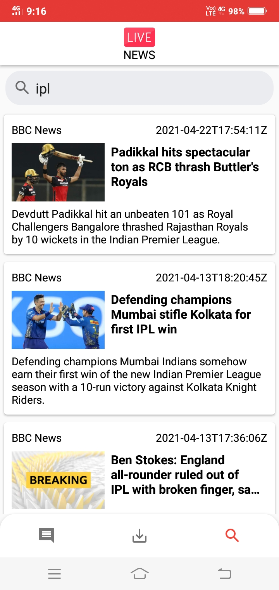

# News App

The goal is to create a News Feed app which gives a user regularly-updated news from the internet related to a particular topic.
In this project, use News API. This is a well-maintained API which returns information.

## Screenshots

